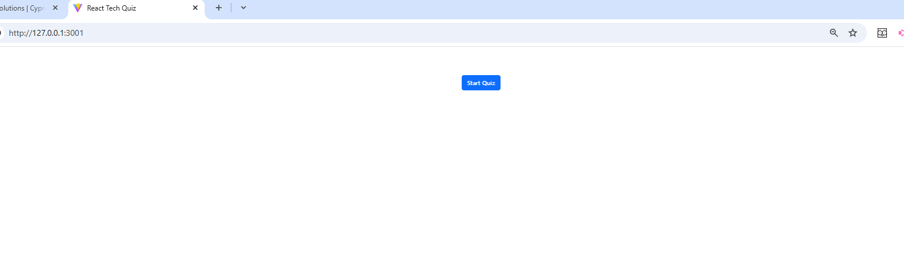
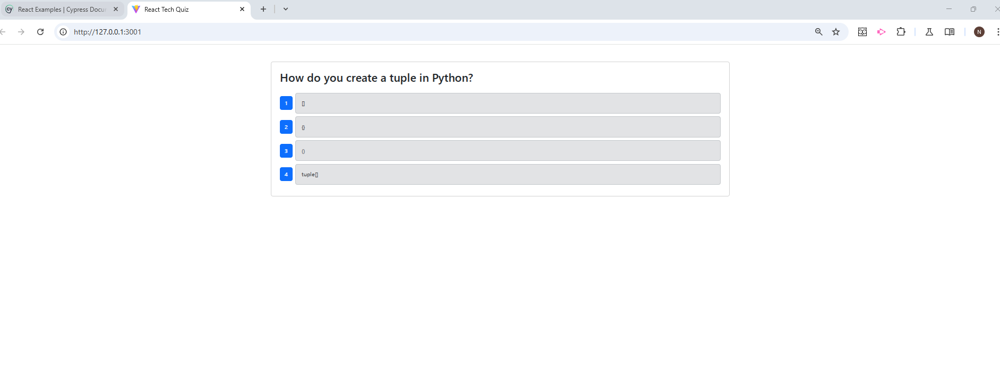
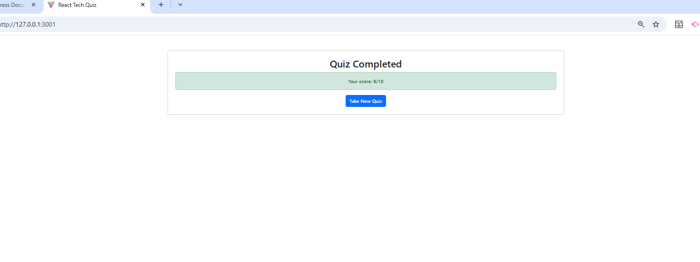
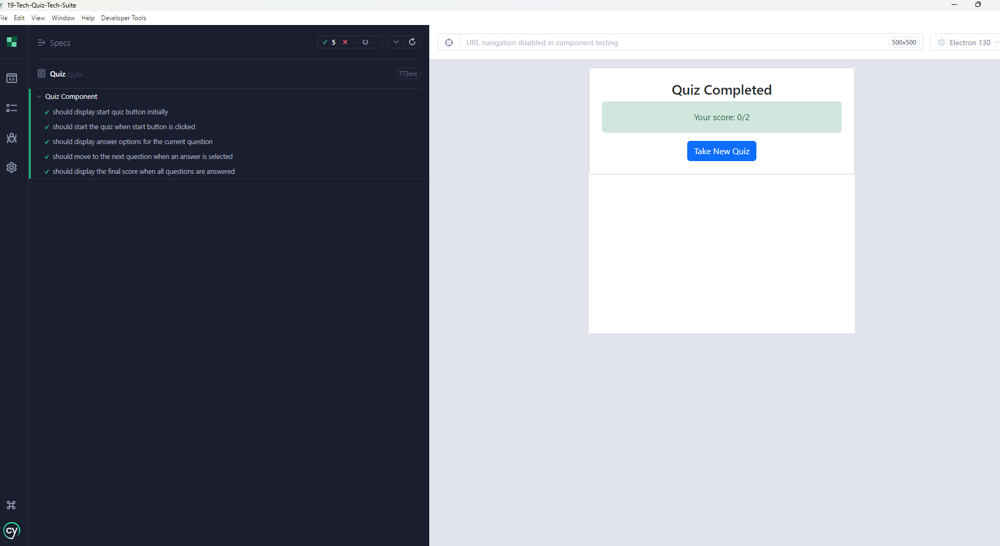
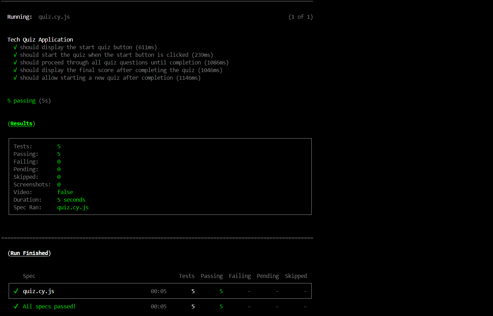

# Tech Quiz - Test Suite using Cypress


## Website: 
[GitHub-link](https://github.com/noIDEA-tech/19-Tech-Quiz-Tech-Suite)

## Description
This project consists of a Tech Quiz application designed to allow users to take a 10 question quiz to test their knowledge of Python language and syntax. It was built using the MERN stack with React, MongoDB Database, and Node.js/Express.js server and API. Cypress has been added to conduct component and end-to-end (e2e) tests for proper functionality.

## Video Link:
[Video-Demonstration-link](https://drive.google.com/file/d/1P3VzmFeBleFQEIT9xpNUDEmWi1yKlSAD/view)

<video controls src="Tech Quiz-Test Suite using Cypress.mp4" title="Title"></video>








## Table of Contents:
- [Installation](#installation)
- [Usage](#usage)
- [Credits](#credits)
- [License](#license)
- [Features](#features)
- [Tests](#tests)
- [Contact](#contact)

## Installations:
```md
- npm install 
- npm install -D cypress 
- npm install -D @cypress/webpack-dev-server @cypress/react babel-loader @babel/preset-env @babel/preset-react @babel/preset-typescript style-loader css-loader --legacy-peer-deps
```
## Usage:
- Run `npm run test` in your root directory terminal

## Credits/Acknowledgements: 
- Nancy Watreas
- Assistance with Cypress test implementation was provided by Anthropic. (2025). Claude.ai [AI Assistant]. Retrieved from https://claude.ai

## License
MIT

## Features:
1. User-facing features:  
    - Users can take a tech quiz to test their Python knowledge
    - Users can start a new quiz with the click of a button
    - Users receive immediate feedback as they progress through questions
    - Users can see their final score after completing the quiz
    - Users can take a new quiz after completing one

2. Developer/testing features:
    - Cypress E2E testing to verify the complete user flow works correctly
    - Cypress component testing to test the Quiz component in isolation
    - Test coverage for all the acceptance criteria

## Tests:
- START SERVER-API: cd server and run the following command:  `npm run start`  
- START CLIENT BROWSER: cd client and run the following command:  `npm run dev`
- To run Component Test and End-to-End Test, navigate back to your root directory and run the following command: `npm run test`

    ### Additional tests:
    - Run E2E tests in headless mode: `npm run test:e2e` or `npx cypress run --e2e`
    - Open Cypress UI for E2E tests: `npx c ypress open --e2e`
    - Open Cypress UI for component tests: `npx cypress open --component`

    ### Test coverage: 
    - E2E tests verify the entire user flow from starting the quiz to completion
    - Component tests check isolated functionality of the Quiz component


## Contact Info: 
If there are any questions or concerns, I can be reached at:
- ##### [github: noIDEA-tech](https://github.com/noIDEA-tech)
- ##### [email: nwatreas2023@gmail.com](mailto:nwatreas2023@gmail.com)
 